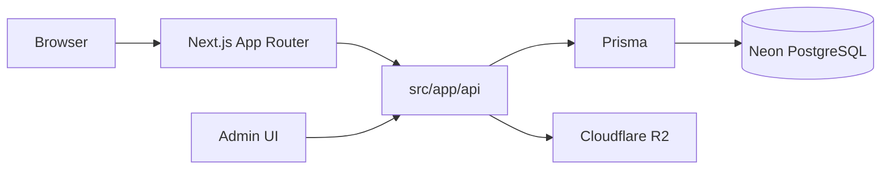

# Qualitech — Ճարտարապետություն

**Չափ.** B · **Fullstack.** Next.js (App Router) · **Backend.** Route Handlers, ոչ առանձին NestJS  
**Վերջին թարմացում.** 2026-04-03

---

## Նշանակություն

Մարքեթինգային կայք + ադմին կոնտենտ (հաստոցներ, բլոգ), բազմալեզու (`ru`/`en`), նկարներ R2-ում, տվյալներ Neon PostgreSQL-ում։

---

## Բարձր մակարդակ

---

## Թղթապանակներ

- `src/app/` — էջեր, `api/` route handlers  
- `src/features/<domain>/` — Zod սխեմաներ, սերվիսներ, repository շերտ (ֆայլ ≤ 300 տող)  
- `src/lib/` — prisma client, logger, shared utils  
- `prisma/` — `schema.prisma`, միգրացիաներ  

---

## API մակերես (նախնական)

Մանրամասն ուղիներ՝ [`docs/API.md`](./API.md)։

| Prefix | Նպատակ |
|--------|--------|
| `/api/machines` | Կատալոգ + admin CRUD |
| `/api/blog` | Բլոգ + admin CRUD |
| `/api/contact` | Կապի ֆորմա |
| `/api/admin/*` | Auth, upload meta |
| `/api/health` | DB connectivity probe (օպս) |
| `GET /api/machines` | `locale`, `categorySlug?`, `featured?`, `page`, `limit` |
| `GET /api/machines/[slug]` | `locale` (query) — մանրամասն քարտ |

---

## i18n

- UI — JSON / next-intl  
- Դինամիկ կոնտենտ — DB, տրանսլյացիայի աղյուսակներ `locale`-ով (տես `docs/TECH_CARD.md`)  

---

## Անվտանգություն

- Արտաքին մուտք — Zod  
- Admin — JWT կամ session, գաղտնի բանալիներ env  
- Գաղտնաբառեր — argon2  
- R2 — presigned կամ սերվերային upload, whitelist content-type  

---

## Հոսթինգ

- Նպատակային. Vercel + Neon + R2 (տես `plan.md`)  
